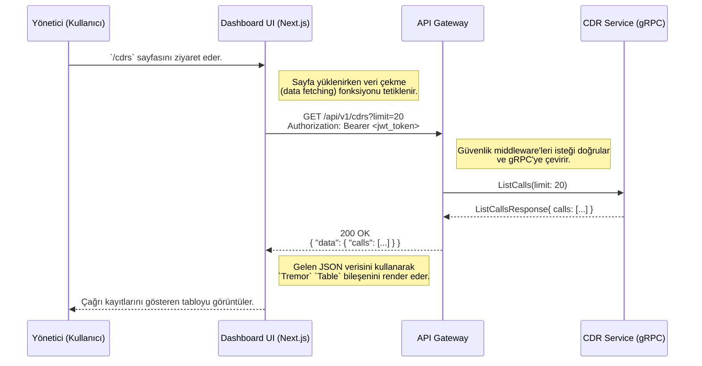

# 🖥️ Sentiric Dashboard UI - Mantık ve Akış Mimarisi

**Belge Amacı:** Bu doküman, `dashboard-ui`'nin Sentiric platformunun **"yönetim ve kontrol merkezi"** olarak stratejik rolünü, temel çalışma prensiplerini ve `api-gateway` aracılığıyla platformun geri kalanıyla nasıl etkileşimde bulunduğunu açıklar.

---

## 1. Stratejik Rol: "Platformun Kokpiti"

Bu arayüz, yöneticilerin ve operatörlerin tüm Sentiric platformunu izlediği, yapılandırdığı ve raporladığı merkezi arayüzdür. Platformun "Genesis Bloğu" felsefesinin, yani **her şeyin kod yerine veritabanından yönetilmesi** prensibinin hayata geçtiği yerdir.

**Bu arayüz sayesinde:**
1.  **Tam Görünürlük Sağlanır:** Yöneticiler, anlık olarak kaç çağrının aktif olduğunu, çağrı hacmini, ortalama konuşma sürelerini ve diğer kritik performans göstergelerini (KPI) izleyebilir.
2.  **Dinamik Yapılandırma Mümkün Olur:** Bir telefon numarasının hangi iş akışını (`dialplan`) tetikleyeceği, yeni bir kullanıcının eklenmesi veya bir anons metninin değiştirilmesi gibi işlemler, kod değişikliği veya yeniden dağıtım gerektirmeden bu arayüz üzerinden yapılabilir.
3.  **Raporlama ve Analiz Kolaylaşır:** Tüm çağrı kayıtları (`CDR`), bu arayüz üzerinden filtrelenebilir, aranabilir ve detayları incelenebilir.

---

## 2. Temel Çalışma Prensibi: Salt API Tüketicisi (API Consumer)

`dashboard-ui`, kendi içinde bir iş mantığı barındırmaz. Tamamen "aptal" bir istemcidir. Tek görevi, `sentiric-api-gateway-service`'in sunduğu REST API endpoint'lerini çağırmak ve dönen JSON verisini kullanıcıya anlamlı grafikler, tablolar ve formlar olarak sunmaktır.

*   **Veri Okuma:** Sayfa yüklendiğinde veya periyodik olarak, `api-gateway`'e `GET` istekleri göndererek en son verileri (kullanıcı listesi, CDR'lar, metrikler) çeker.
*   **Veri Yazma:** Bir yönetici "Yeni Kullanıcı Ekle" formunu doldurup kaydettiğinde, arayüz bu veriyi bir JSON nesnesine çevirir ve `api-gateway`'e bir `POST` isteği gönderir.
*   **Kimlik Doğrulama:** Arayüz, bir "login" sayfası aracılığıyla kullanıcıdan kimlik bilgilerini alır, `api-gateway`'in `/auth/login` endpoint'ine gönderir ve karşılığında bir JWT (JSON Web Token) alır. Sonraki tüm API isteklerinde bu JWT'yi `Authorization: Bearer <token>` başlığı ile gönderir.

---

## 3. Uçtan Uca Akış: Bir Çağrı Kaydının Görüntülenmesi

